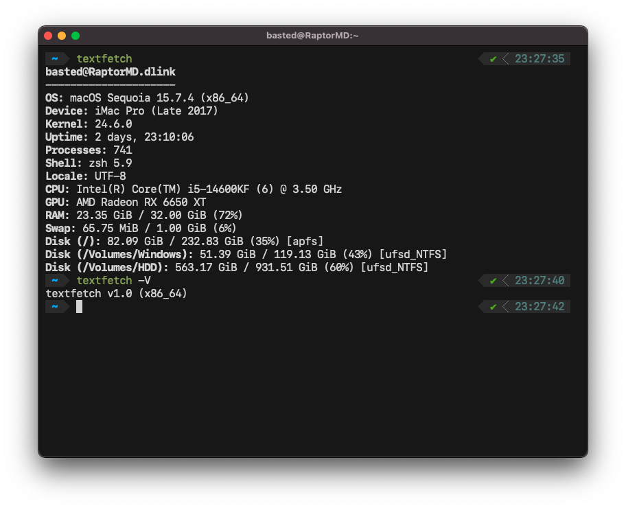

<h3 align="center">textfetch</h3>

<p align="center">
    <strong>
    Another fetch tool for UNIX systems, written just for fun.
    </strong>
</p>
<p align="center">
    <a href="https://github.com/b1sted/textfetch/actions/workflows/release.yml">
        
    </a>
    <a href="https://github.com/b1sted/textfetch/releases/latest">
        
    </a>
    <a href="#license">
        
    </a>
</p>
<p align="center">
    <a href="#features">Features</a> •
    <a href="#supported-platforms">Supported Platforms</a> •
    <a href="#build-and-run">Build and run</a> •
    <a href="#license">License</a>
</p>
<hr>

A minimal, fast, and dependency-free system information tool. Designed to cleanly output hardware and software specifications natively using zero external libraries (relies entirely on `sysfs`, `sysctl`, `IOKit`, etc.).

<br>
<p align="center">
  
</p>
<br>

## Features

- **CPU**: Topology (cores counting), frequency, and model identification.
- **GPU**: Vendor and device detection via DRM subsystem (Linux) and IOKit (macOS).
- **Power**: Battery capacity, status, health percentage, and model.
- **Memory & Storage**: RAM/Swap usage and detailed mount point metrics.
- **Software**: OS version, kernel, shell, locale, and process count.
- **Zero bloat**: No third-party dependencies required for standard macOS and Linux. Written in pure C99 *(Note: Android/Termux requires `mesa-dev` for GPU detection)*.

## Supported Platforms

`textfetch` natively supports the following architectures and operating systems out-of-the-box:

- **macOS**: Both Intel (x86_64) and Apple Silicon (ARM64). Minimum supported OS: Mac OS X 10.7 Lion.
- **Linux**: x86_64 and ARM64. Built and tested on Ubuntu. 
- **Android**: Natively supported via Termux (`aarch64`).
- **IoT/Embedded**: Compiles for the Luckfox Pico Mini.

## Build and run

### Compilation from source
Requires any standard C99 compiler and `make`.

```bash
make
```

### Usage

```bash
./bin/textfetch
```

### Pre-built binaries
Pre-compiled tarballs for macOS, Linux, and Android (Termux) are available in the [Releases](https://github.com/b1sted/textfetch/releases) section.

## License

Distributed under the **MIT License**.

You are free to use, modify, distribute, and sell this software. The only requirement is to preserve the copyright notice and the license file in any substantial portion of the software.

Full text of the license: [LICENSE](./LICENSE).